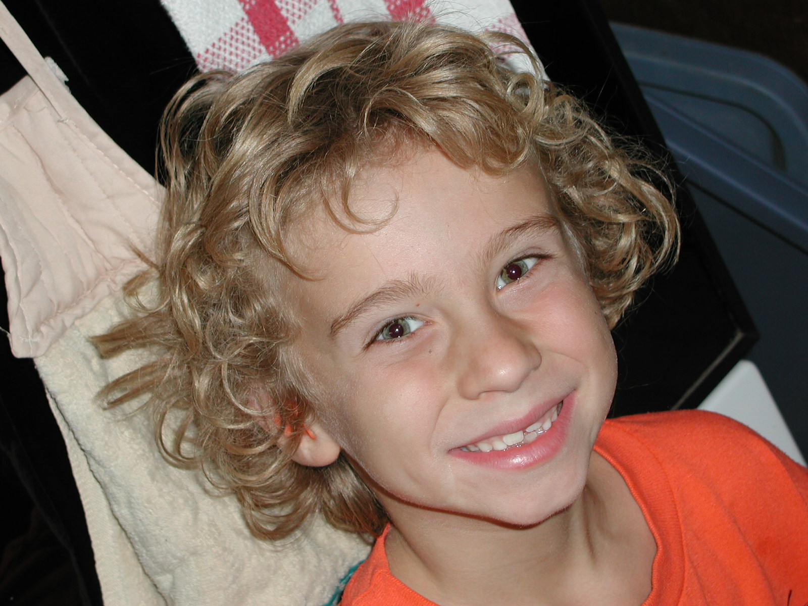
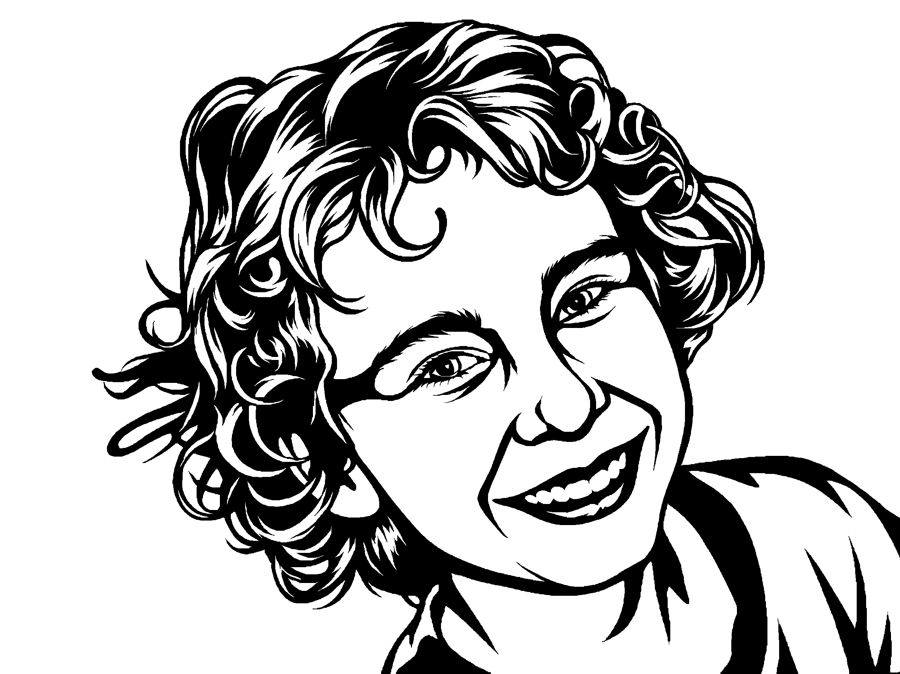

# notan-cut

Turn any photo into Notan-style black-and-white art that can be cut from a single sheet of metal on a fiber laser.

## Credit: this is NeedItMakeIt's method

**This project would not exist without [NeedItMakeIt](https://www.youtube.com/@NeedItMakeIt) and his video
["Converting any photo into Artwork and making it with the xTool MetalFab"](https://www.youtube.com/watch?v=OXh7r_nBAEA) (February 2026).**

The method is his. This repo only automates the steps he worked out and shared for free.
Before you use it, **watch his video**. It shows the parts no script can, such as judging the detail level, cutting, finishing and mounting.

Ideas and techniques from his video that this repo uses:

- **The word "Notan."** He tried "stencilize," "make this laser cuttable" and "black and white," and none of them worked. Asking Gemini for *Notan style*, the Japanese art of flat light and dark shapes, is what made it work.
- **The base prompt.** The round-1 prompt in [`SKILL.md`](SKILL.md) is his prompt from the video description. I only added sentences that ask for solid black on white and for no loose pieces, which is also something he asks for in the video.
- **Telling the model the art will be metal wall art,** so it plans for structure.
- **Using highlights, and reflections on cars, to guide where the detail goes.**
- **Starting a new chat for each attempt, and re-attaching the original image every round.** The model otherwise drifts toward its previous result.
- **Refining one step at a time:** ask for slightly more or less detail and steer between rounds.
- **Upscaling blurry photos first.**
- **Fixing the last loose pieces by hand in xTool Studio** with thin bridges, or with a border frame.
- **The cut and finish:** 20 ga cold-rolled steel, the xTool MetalFab settings, black paint, and mounting on a pine board.

If this repo is useful to you, please support him:

- Subscribe: <https://www.youtube.com/@NeedItMakeIt>
- Patreon: <https://www.patreon.com/Needitmakeit>
- Buying an xTool MetalFab? His affiliate link and coupon code **NM100** (from the video description): <https://www.xtool.com/products/xtool-metalfab-laser-welder-and-cnc-cutters?ref=mqxcefeo&utm_medium=affiliate&utm_source=goaffpro&utm_term=5306>

This repo isn't affiliated with or endorsed by NeedItMakeIt or xTool.

## What this repo adds

The one new piece is a **cuttability check**. In the video, you judge by eye whether anything will fall out.
`notan.py check` measures it instead:

- **Islands:** black pieces not connected to the main body, which would drop out when cut.
- **Thin metal:** areas narrower than your minimum metal width at the finished size, which would burn away or warp.

It writes an overlay (red = island, blue = too thin), and the next prompt can name exactly which piece to fix.
The rest is plumbing: a Gemini API wrapper, a potrace step that writes the cut file as an SVG at the real size, and a [Claude Code](https://claude.com/claude-code) skill (`SKILL.md`) that runs his round-by-round loop.

## No install? Use the manual guide

**[GUIDE.md](GUIDE.md)** walks through the whole method using a free chat AI (Gemini, ChatGPT, Grok, and so on), a free paint program and your laser software. You don't need Python, Claude Code or an API key.

## Example

A portrait, 8 rounds, planned at 400 mm wide:

| Source photo | Final art |
| --- | --- |
|  |  |

Portraits are the hard case: the eyes, nose and mouth tend to float free inside an open white face, and how they get attached decides whether the face still looks human.
Asking Gemini for "bridges" gave this face clown makeup, and running a line out from the corner of the mouth gave it the Joker's smile. What worked was asking it to extend existing lines along the face's real anatomy.
The mouth stops about 2 mm short of the smile folds at both corners, and two tiny hand bridges in xTool Studio close it. Those, plus the two shirt spikes in the bottom-right corner, are all that's left to bridge.
The cut file, traced with potrace at 400 mm wide, is [`020703-070728.svg`](examples/portrait/020703-070728_notan/020703-070728.svg).
Every prompt (`prompt1–9.txt`), every round and its overlay, and the hand-off note ([`README.md`](examples/portrait/020703-070728_notan/README.md)) are in [`examples/portrait/`](examples/portrait/).

## Install

As a Claude Code skill:

```
git clone https://github.com/holla2040/notan-cut ~/.claude/skills/notan
pip install opencv-python numpy pillow
export GEMINI_API_KEY=...        # Windows: setx GEMINI_API_KEY "..."
python3 ~/.claude/skills/notan/notan.py selftest
```

You also need [potrace](https://potrace.sourceforge.net/) to write the SVG: `sudo apt install potrace` on Linux, `brew install potrace` on macOS, or the Windows build from its site, on your PATH.

Then, in Claude Code, give it a photo and say `/notan`.

## Use without Claude

```
notan.py gen PHOTO OUT.png --prompt-file P.txt [--ref PREV.png] [--size 2K]   # one Gemini (Nano Banana Pro) call
notan.py check IMG.png --width-mm 400 [--min-mm 1.0] [--fix]                  # islands + thin metal, writes IMG_check.png
notan.py trace IMG.png OUT.svg --width-mm 400                                 # SVG cut file at real size (potrace)
notan.py selftest
```

Each `gen` call is a paid image generation. The full procedure, with the correction phrases for each problem, is in [`SKILL.md`](SKILL.md).

## License

MIT, for the code in this repo. The method and the original prompt belong to NeedItMakeIt; see [Credit](#credit-this-is-needitmakeits-method).
