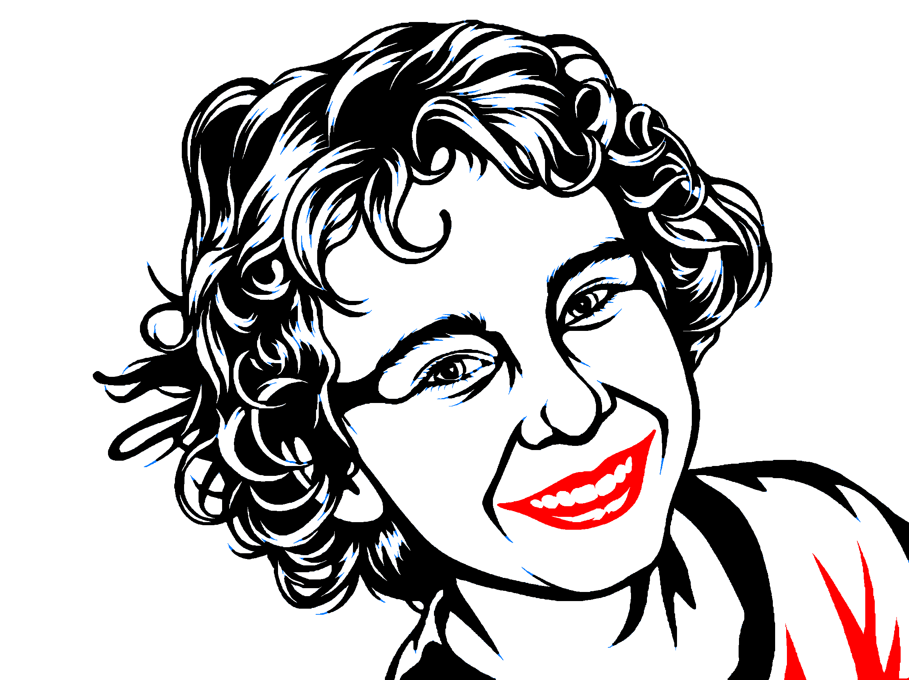

# 020703-070728: Notan metal art, next steps

Source photo: `020703-070728.jpg` (moved into this folder when the run finished)
Image to cut: **`round8_clean.png`**, planned at **400 mm wide** (the default; no width was given).
Cut file: **`020703-070728.svg`**, traced from it with potrace. The page is 400 × 300 mm; the art inside is about 359 × 291 mm, because the image has a white margin on the left.
Made with the `notan` skill on 2026-10-04 in 8 Gemini rounds, plus round 9 as an alternative. Every prompt is saved as `prompt1–9.txt`.

| Supplied photo | Where we stopped: round 8, **3 loose pieces in red** (blue = too thin) |
| --- | --- |
|  |  |

> [!WARNING]
> **This image still has 3 loose pieces: the mouth and the two shirt spikes in the bottom-right corner.** They would fall out when cut, so they must be repaired by hand in xTool Studio before cutting. Step 3 bridges the mouth, and step 4 connects the shirt spikes.

## Where it stands

| Check | Result | What to do |
| --- | --- | --- |
| Eyes, eyebrows, nose | Connected | Nothing |
| Mouth (lips and teeth) | **Loose**, 880 mm². Gaps of 1.9 mm at the left corner and 2.3 mm at the right corner | Bridge both corners by hand (step 3) |
| Shirt | **2 loose spikes** in the bottom-right corner (646 and 108 mm²) | Connect them (step 4) |
| Specks | 213 removed | Nothing |
| Metal thinner than 1 mm | 1.39 % of the metal, mostly tapered hair tips | Accept it, or thicken the worst tips (step 5) |

`round8_clean_check.png` shows the problems: red = loose piece, blue = too thin.

### Why round 8, and not a fully connected round

Portraits are the hard case: the mouth floats free inside an open white face, and how it gets attached decides whether the face still looks human.

| Round | Mouth joined by | Result |
| --- | --- | --- |
| 5 | Two "solid black bridges" Gemini drew 5–13 mm wide, on lit cheek and chin | Fully connected, but looks like clown makeup |
| 7 | The smile line extended past the corner of the mouth, up to the face outline | Thin (about 1–2 mm), but reads as the Joker's scarred smile |
| **8** | Lines that follow the real anatomy: the smile folds from the nose down to the mouth corners, and a nose-side line up to the eye | **The most natural face.** The folds stop 2 mm short of the mouth corners. |
| 9 | Round 8 with the two gaps closed | Fully connected, but the folds became unbroken brackets around the mouth and age the face |

Round 8 with two tiny hand bridges looks better than any fully connected round. `round9.png` is kept in case you prefer zero hand work.

## 1. Pick the size

400 mm wide makes it about 300 mm tall. To change the size, re-run the check and the trace at the new width, because what counts as "too thin" depends on the final size:

```
python3 ~/.claude/skills/notan/notan.py check round8_clean.png --width-mm <W>
python3 ~/.claude/skills/notan/notan.py trace round8_clean.png 020703-070728.svg --width-mm <W>
```

At 500 mm or more, thin metal drops to about 0.8 %.

## 2. Import the SVG into xTool Studio

1. New project, then import `020703-070728.svg`.
2. Keep it at the size it imports at (art about 359 mm wide). Don't stretch it to 400 mm; the thin-metal check assumed this size.

The SVG is already traced, so xTool Studio's **Trace image** isn't needed. To trace there instead: import `round8_clean.png`, **Trace image**, check that the preview is *closed* outlines, apply, delete the bitmap, and set the width to 400 mm with the aspect ratio locked.

## 3. Bridge the mouth (the two corners)

Each corner of the mouth ends in a point that stops just short of the fold line beside it. Close each gap by continuing the point of the mouth until it merges into that line:

1. **Left corner** (left side of the image): about 1.9 mm to the smile fold that comes down from the nose.
2. **Right corner** (right side of the image): about 2.3 mm to the fold line coming down from the nostril.

Make each bridge about as wide as the fold line it joins (1.5–2 mm). Keep it short and in line with the corner's own point. Don't run it outward into the cheek, or it reads as an extended smile, the same Joker look as round 7.

## 4. Connect the two shirt spikes

Choose one:
- **Bottom bar (easiest).** Draw a rectangle along the bottom edge, about 8–10 mm tall, spanning the art, and union it with the vector. The spikes and the shirt already run to that edge, so everything joins, and the bar doubles as a base or hanging rail.
- **Border frame.** A rectangle around the whole piece, 8–10 mm wide, that the hair, shirt and spikes all touch. Union it with the vector. This is what the video did for the grizzly. It's sturdier, and mounting holes can go in the frame.
- **Bridges.** Thin lines (at least 1.5 mm wide) from the top of each spike to the black shirt band above it. This changes the look the least.

## 5. Thin metal (optional)

The blue spots in `round8_clean_check.png` are hair tips that taper to a point. On 20 ga steel they'll burn back slightly and come out a bit shorter. That's cosmetic, not structural. To fix the worst ones, widen them in xTool Studio, or trim them off square.

## 6. Final look for loose pieces

Before cutting, ask: if this were cut out right now, would any black shape fall away? Check zoomed in around the two new mouth bridges, the eyes, the teeth, the ear and every curl. Bridge anything that would.
Optional: import the SVG into Fusion, extrude it 1 mm, and drag the body around. Anything that doesn't move with it is loose.

## 7. Mounting

- Frame option: 2–4 holes, about 5 mm, in the frame corners.
- No frame: holes in solid black areas of the hair, at least 5 mm from any edge. Or skip holes and glue it to a backer board.
- Optional, as in the video: stencil-font text in empty space (a name or date). It must touch the frame or the art.

## 8. Export

Export the bridged result to this folder as `020703-070728_final.svg`. Keep the `.xs` project file next to it.

## 9. Cut (xTool MetalFab, as in the video)

- 20 ga cold-rolled mild steel. **Degrease it first**, because it ships oiled.
- Material preset: "1 mm carbon steel". 2 mm nozzle, compressed-air assist.
- Clamp the sheet flat and calibrate the height sensor.
- Use the space efficiently; rotate the design if that saves a strip of sheet.
- Process with the lights off to watch it. Small dropped pieces can tip up; check that the nozzle path clears them.

## 10. Finish

1. Knock off dross along the bottom edges with a file or deburring tool.
2. Wipe down with alcohol.
3. Spray paint black in light coats. Black works best on most walls.
4. Optional: mount it on a planed 1×12 pine board, with a recessed adjustable hanger on the back so it's easy to level.

## Files here

| File | What it is |
| --- | --- |
| `020703-070728.jpg` | Original photo |
| `020703-070728.svg` | Cut file, traced from `round8_clean.png` |
| `round8_clean.png` | Image the SVG was traced from |
| `round8_clean_check.png` | Problem overlay for the final image |
| `round5_clean.png` | The earlier fully connected version (the clown mouth) |
| `round9.png` | Fully connected alternative to round 8 (bracketed mouth) |
| `round1–9.png`, `prompt1–9.txt` | Every round and the prompt that produced it |
| `round*_check.png` | Overlay for each round |
